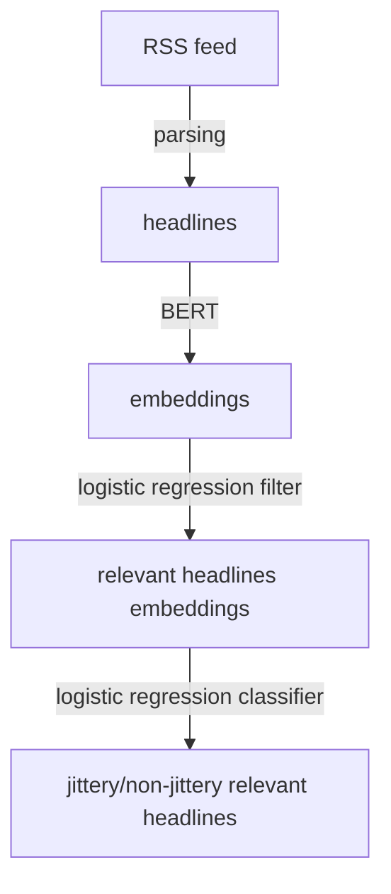

# Jitter

A natural language processing tool to measure instability from news headlines.

## Design
The current data pipeline is as follows


To learn more about the research part of the project, refer to [`research/README.md`](research/README.md) and read the notebooks in the [`research/`](research/) folder.

## Usage
Instantiate a `JitterEvaluator` class: this is the main engine
```python3
engine = JitterEvaluator()
```
The constructor takes an optional argument to specify the HuggingFace BERT model to use for embeddings. Defaults to
```python3
engine = JitterEvaluator(embedding_model="ProsusAI/finbert")
```

The engine needs to be trained.  To train it, call the `train()` method with a Pandas dataframe with columns `embedding` (as vectors), `relevant` (0/1), `jittery` (float from 0 to 1):
```python3
engine.train(df)
```

Note that the embeddings should be produced by the same model specified in the `JitterEvaluator` constructor.  For your convenience, [`data/training.csv`](data/training.csv) contains a training dataset (see [`example.ipynb`](example.ipynb) for more details).

To process headlines, pass them as a Pandas series to the `process_headlines()` method:
```python3
engine.process_headlines(headlines)
```

The `current_prediction` property of engine gives the scores for all headlines.

For your convenience, the `routines` module contains also a `get_headlines()` function to automatically retrieve headlines from a list of RSS urls:
```python3
get_headlines(urls, trim=300)
```

The parameter `trim` determines how many headlines to keep (most recent first).  A list of RSS feed urls is contained in [`data/sources.csv`](sources.csv).

For a more complete interactive usage example, see [`example.ipynb`](example.ipynb).